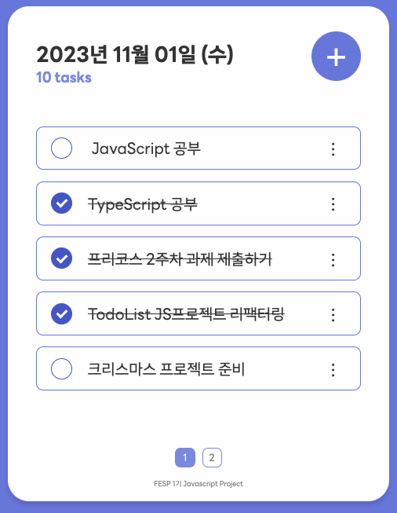
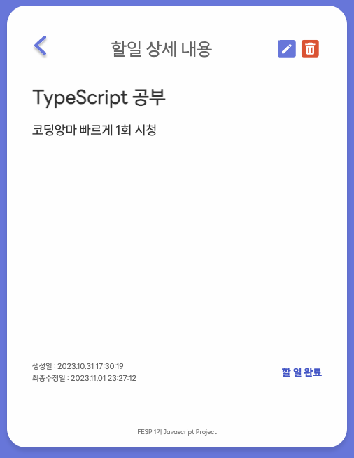
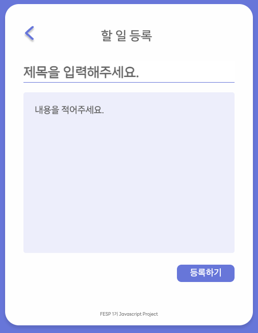
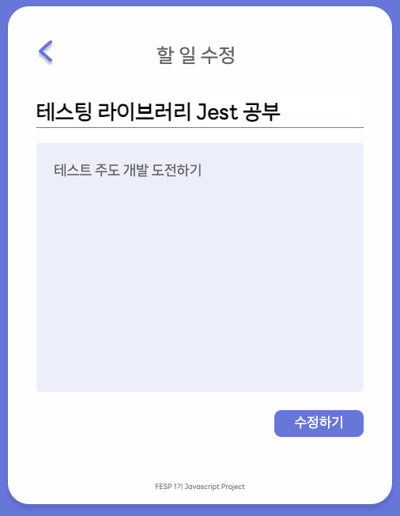

# 멋쟁이 사자처럼 FESP 1기 6조 : 미니 프로젝트(TODO App)

## 📌 프로젝트 팀원
<table>
<tr>
	<td>
		<br>
		<br>
		<br>
		유재영
	</td>
	<td>
		<br>
		우승미
	</td>
	<td>
		<br>
		윤선영
	</td>
	<td>
		<br>
		윤태현
	</td>
	<td>
	 <br>
	 송수빈
	</td>
	<td>
		<br>
		신은수
	</td>
	<td>
		<br>
		안중후
	</td>
	<td>
		<br>
		서진만
	</td>
	<td>
		<br>
		현지수
	</td>
</tr>
<tr>
	<td><a href="https://github.com/zxxng">zxxng</a></td>
	<td><a href="https://github.com/wSeungMi">wSeungMi</a></td>
	<td><a href="https://github.com/seonyeongyoon">yoon</a></td>
	<td><a href="https://github.com/yoonth95">yoonth95</a></td>
	<td><a href="https://github.com/ssb1565b">ssb1565b</a></td>
	<td><a href="https://github.com/ShinEun9">ShinEun9</a></td>
	<td><a href="https://github.com/hookor">hookor</a></td>
	<td><a href="https://github.com/seojinman">seojinman</a></td>
	<td><a href="https://github.com/hyunzsu">hyunzsu</a></td>
</tr>
</table>

- 🔗 GitHub URL: https://github.com/todolist-refactoring-project/Todo-Project
- 🎨 Figma: [Figma](https://www.figma.com/file/cBxAPfNJHH4W0s1ZoCFhmH/%5BFESP%5D-%ED%88%AC%EB%91%90%EB%A6%AC%EC%8A%A4%ED%8A%B8-%ED%94%84%EB%A1%9C%EC%A0%9D%ED%8A%B8_6%EC%A1%B0?type=design&node-id=0-1&mode=design&t=i6VcsLKAgantBfT5-0)
- 📝 Notion: [TodoList JS 프로젝트 6조](https://pushy-barnacle-128.notion.site/TodoList-JS-6-b4a1c732717340718d79a259d4caca4a?pvs=4)

### 🎯 프로젝트 목표

- DOM & axios를 활용한 Vanilla JS 프로젝트 완성
- 2인 1조 페어프로그래밍으로 TodoList 서비스 만들기

### 🛠️ 기능 구현 목록

- [x] TodoList 목록 조회
- [x] TodoList 상세 조회
- [x] TodoList 등록
- [x] TodoList 수정
- [x] TodoList 삭제

### ✨ UI

|                            목록 조회                            |                            상세 조회                            |
| :-------------------------------------------------------------: | :-------------------------------------------------------------: |
|  |  |

|                             등록                             |                             수정                             |
| :----------------------------------------------------------: | :----------------------------------------------------------: |
|  |  |

## 🌐 API & Web 서버 구동

### API 서버 구동

```
cd 00.API/api
npm i
npm start
```

- api 서버 사용방법: http://localhost:33088/apidocs

### Web 서버 구동

📍**JavaScript**

```
cd 01.javascript/todoapp
npx serve -s .
```

- -s 옵션: 라우터를 추가할 경우 클라이언트가 요청한 모든 URL에 대해서 index.html을 응답하도록 설정
- http://localhost:3000 접속 ▶️ 이미 3000 포트가 사용중일 경우 콘솔 안내 메세지에 따라서 접속

📍**TypeScript**

```
cd 02.typescript/todoapp
npm install
npm run dev
```

- 개발 서버 접속
  - 기본 포트는 5173으로 구동되고 해당 포트가 사용중일 경우 번호가 하나씩 증가
  - http://localhost:5173/
- HMR (Hot Module Replacement) 지원됨

📍**React**

```
cd 03.react/todoapp
npm install
npm start
```
